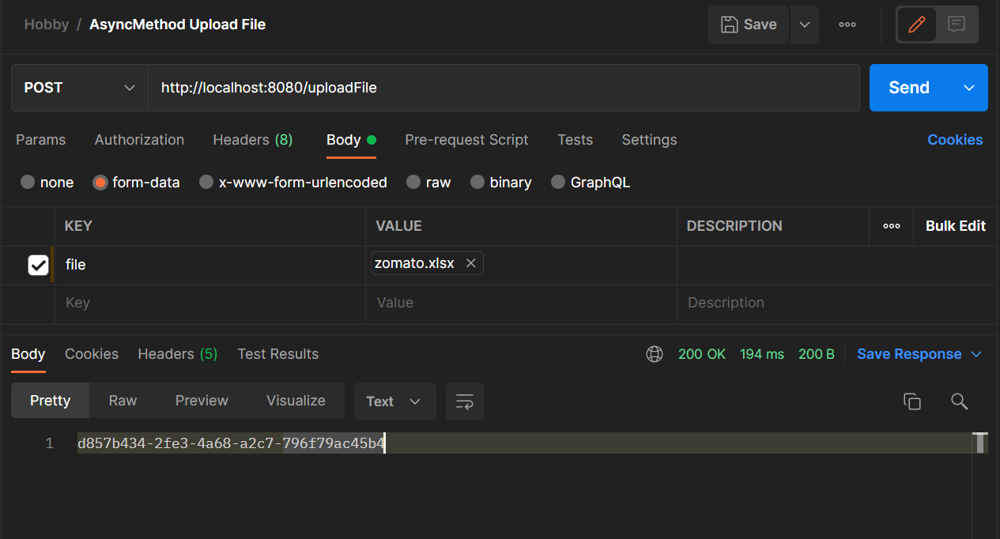

<h1>Demonstration of Asynchronous method in Spring boot</h1>

The idea is to run a method in background which saves a big Excel file to a database, around 10000 rows and track its progress.

<h4>How it works ?</h4>
<ul>
    <li>@EnableAsync is Annotated to the method in service class, which needs to be run in background.</li>
    <li>The logic while running, just hits the method that is annotated with @EnableSync and moves to next line. Making it run in background. </li>
    <li>A random id is generated at the starting. After every single row insertion, the progress is saved in database to another table along with the random id.</li>
    <li>Using the random id, the progress can be retrieved from the database, and can be refreshed after certain intervals and displayed as a progress.</li>
</ul>

<h4>Screenshots</h4>

A a dataset of Zomato restaurants from Kaggle is used as a data file. A random id is generated as soon as the method is made to run.

With the id generated, another endpoint is run to track the progress.

<h2>Note : </h2>
<ul>
    <li>The @EnableSync annotated method is to in different class, not in the same class where call the method. </li>
    <li>SQL Queries for creating the tables and the dataset file is inside the project.</li>
    <li>The data in progress table is made to delete after completion of the progress, with a sleep time of 10secs.</li>
    <li>If more time is needed (to mock it as even big process), enable the commented Sleep time in Service.class. It will make process run longer with sleep time in between every row, and can be used for understanding the code flow better</li>
</ul>
